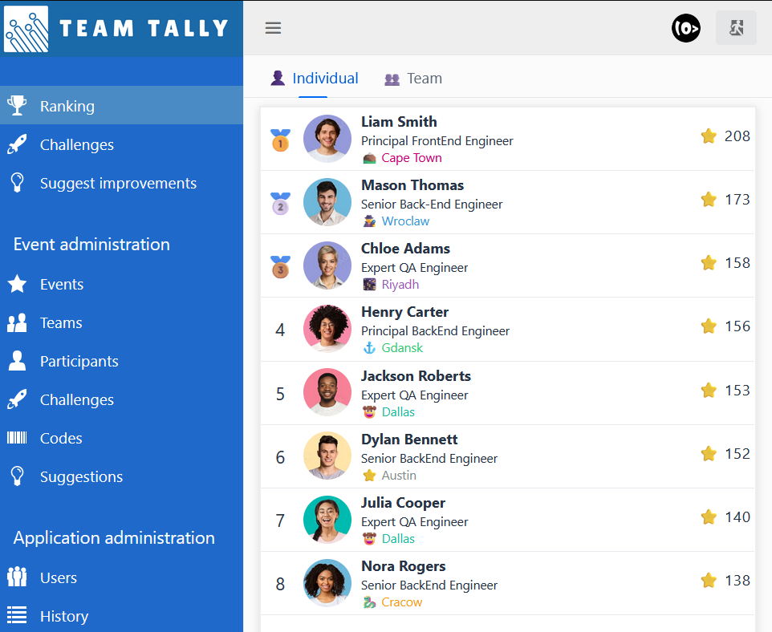
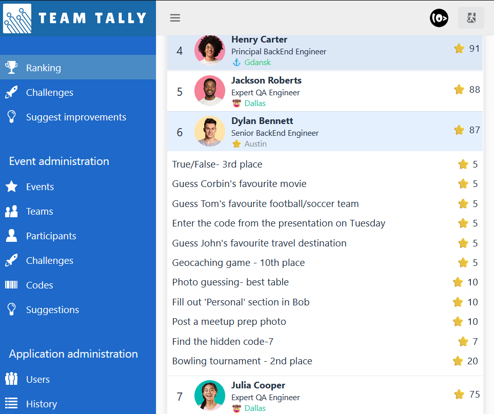
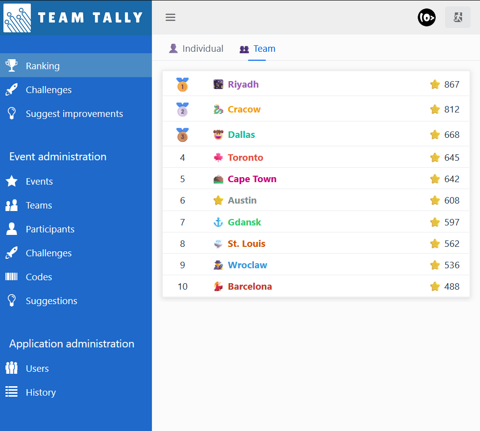
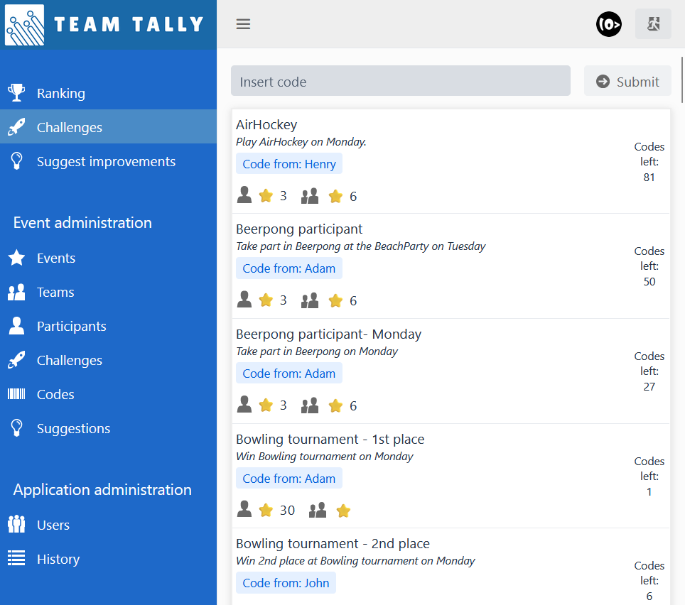

## TeamTally
<b>Complete challenges to gain points!</b>

### ℹ️ Description
The app has been created to help organizations enhance productiveness and motivation amongst employees. 
It is based on multiple challenges that can be completed within set timeframe.
The challenges are marked as completed by the admin who distributes codes that correspond with activities.

### ✨ Features
* create events
* add participants
* create teams
* add challenges
* gain points by completing challenges
* track individual and team ranking

### 🥞 Technology stack
* Java 21
* Spring Boot 3
* Hibernate 6
* Vaadin 24

### 🖼️ Screenshots
&nbsp;
&nbsp;
 
&nbsp;

